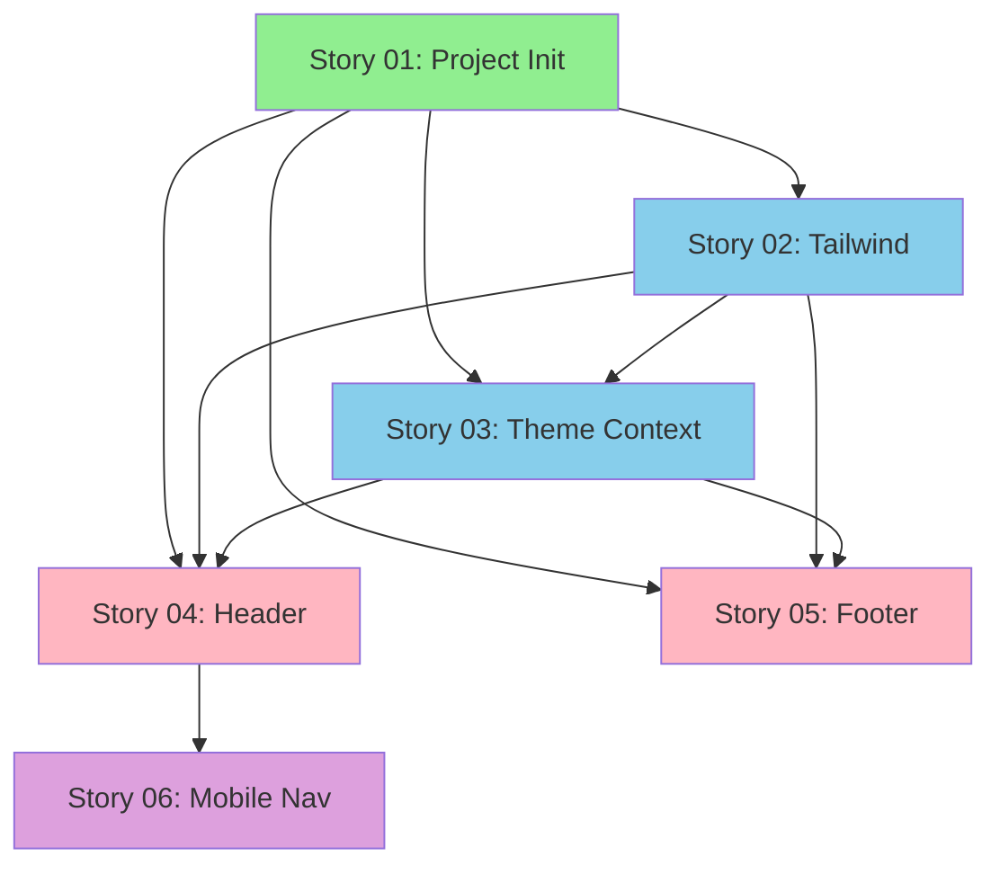

# Stories for Epic 001: Website Foundation & Theme System

**Source epic:** .storyline/epics/epic-001-website-foundation-theme.md
**Generated:** 2026-01-10
**Total stories:** 6

---

## Stories Overview

### Story 01: Vite + React 19 + TypeScript Project Initialization
**As a:** BlockHaven website developer
**I want:** A working Vite + React 19 + TypeScript development environment with proper project structure
**Value:** Foundation for all development - enables team to start building immediately
**Status:** Ready for spec
**Estimated effort:** 1-2 hours

### Story 02: Tailwind CSS v4 Configuration with Minecraft Theme
**As a:** BlockHaven website developer
**I want:** Tailwind CSS v4 configured with a custom Minecraft-themed color palette
**Value:** Enables rapid UI development with consistent brand colors
**Status:** Ready for spec
**Estimated effort:** 2-3 hours

### Story 03: Theme Context & Dark Mode Implementation
**As a:** BlockHaven website visitor
**I want:** To toggle between dark and light modes and have my preference remembered
**Value:** Improved user experience and accessibility, meets modern website expectations
**Status:** Ready for spec
**Estimated effort:** 3-4 hours

### Story 04: Responsive Header Component with Navigation
**As a:** BlockHaven website visitor
**I want:** A sticky header with logo, navigation links, and theme toggle
**Value:** Primary navigation mechanism - enables site exploration
**Status:** Ready for spec
**Estimated effort:** 4-5 hours

### Story 05: Footer Component with Server Info
**As a:** BlockHaven website visitor
**I want:** A footer with server IP, quick links, and essential information
**Value:** Persistent access to critical server IP and secondary navigation
**Status:** Ready for spec
**Estimated effort:** 2-3 hours

### Story 06: Mobile-Responsive Navigation with Hamburger Menu
**As a:** BlockHaven website visitor on mobile
**I want:** A hamburger menu that reveals navigation links when tapped
**Value:** Professional mobile UX for 50%+ of traffic from mobile devices
**Status:** Ready for spec
**Estimated effort:** 3-4 hours

---

## Story Dependencies



**Legend:**
- 🟢 Green: Foundation (no dependencies)
- 🔵 Blue: Core infrastructure (depends on foundation)
- 🌸 Pink: Layout components (depends on foundation + infrastructure)
- 🟣 Purple: Enhancements (depends on layout)

---

## Recommended Execution Order

### Phase 1: Foundation (Day 1 - Morning)
**Must complete sequentially:**

1. **Story 01** - Vite + React Project Initialization
   - No dependencies, start here
   - Creates project structure
   - ~1-2 hours

2. **Story 02** - Tailwind CSS Configuration
   - Depends on: Story 01
   - Sets up styling system
   - ~2-3 hours

### Phase 2: Theme System (Day 1 - Afternoon)
**Can start after Phase 1:**

3. **Story 03** - Theme Context & Dark Mode
   - Depends on: Stories 001, 002
   - Core functionality for all components
   - ~3-4 hours

### Phase 3: Layout Components (Day 2)
**Can work in parallel after Phase 2:**

4. **Story 04** - Header Component
   - Depends on: Stories 001, 002, 003
   - Primary navigation
   - ~4-5 hours

5. **Story 05** - Footer Component
   - Depends on: Stories 001, 002, 003
   - Can work in parallel with Story 04
   - ~2-3 hours

### Phase 4: Mobile Experience (Day 2 - Final)
**Complete after Header:**

6. **Story 06** - Mobile Navigation
   - Depends on: Story 04 (Header)
   - Completes responsive design
   - ~3-4 hours

---

## Total Estimated Effort

**Time breakdown:**
- Phase 1 (Foundation): 3-5 hours
- Phase 2 (Theme System): 3-4 hours
- Phase 3 (Layout Components): 6-8 hours
- Phase 4 (Mobile): 3-4 hours

**Total: 15-21 hours (2 full development days)**

---

## Success Criteria for Epic 001

When all stories are complete:

- ✅ `pnpm dev` starts Vite development server
- ✅ Tailwind CSS with Minecraft colors works throughout site
- ✅ Dark/light mode toggle works and persists
- ✅ Header displays with logo, nav, and theme toggle
- ✅ Footer displays with server IP and links
- ✅ Mobile navigation works with hamburger menu
- ✅ Responsive design works on mobile, tablet, desktop
- ✅ All layout components render without errors

---

## Next Steps

### Start with Story 01:
```bash
/spec-story .storyline/stories/epic-001/story-01-vite-react-project-initialization.md
```

### Or view all stories:
```bash
ls -la .storyline/stories/epic-001/story-00*.md
```

### After completing all stories:
Move to **Epic 002: Content Pages & UI Component Library** to build actual pages and components.

---

## Technical Stack Summary

**Dependencies for Epic 001:**
```json
{
  "dependencies": {
    "react": "^19.0.0",
    "react-dom": "^19.0.0",
    "react-router-dom": "^7.0.0",
    "clsx": "latest",
    "tailwind-merge": "latest",
    "lucide-react": "latest",
    "framer-motion": "^12.0.0"
  },
  "devDependencies": {
    "@tailwindcss/vite": "latest",
    "tailwindcss": "^4.0.0",
    "autoprefixer": "latest",
    "postcss": "latest",
    "@types/react": "latest",
    "@types/react-dom": "latest",
    "typescript": "^5.7.0",
    "vite": "^6.0.0"
  }
}
```

**Files created in Epic 001:**
- vite.config.ts
- tailwind.config.js
- src/styles/index.css
- src/contexts/ThemeContext.tsx
- src/hooks/useTheme.ts
- src/components/layout/Header.tsx
- src/components/layout/Footer.tsx
- src/components/layout/Navigation.tsx
- src/components/widgets/ThemeToggle.tsx

---

**Status:** ✅ All stories ready for technical spec creation
**Last Updated:** 2026-01-10
