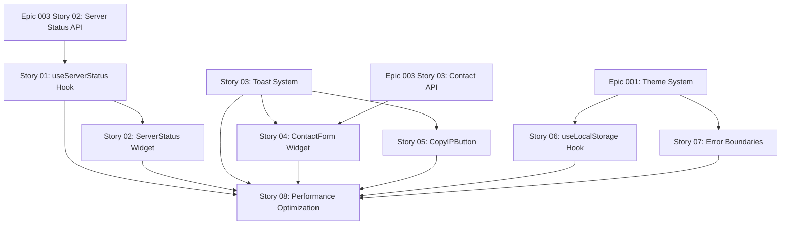

# Stories for Epic 004: Interactive Features & Frontend Integration

**Source epic:** [.storyline/epics/epic-004-interactive-features-integration.md](../../epics/epic-004-interactive-features-integration.md)

**Generated:** 2026-01-12

**Total stories:** 8

---

## Stories Overview

### Story 01: Server Status Polling Hook
**As a:** Website visitor
**I want:** Server status to automatically refresh every 30 seconds
**Value:** Always see up-to-date player counts without manual refresh
**Status:** Ready for spec
**File:** [story-01-server-status-polling-hook.md](story-01-server-status-polling-hook.md)

### Story 02: Live Server Status Widget
**As a:** Potential player
**I want:** See current server status and player count
**Value:** Decide if now is a good time to join the server
**Status:** Ready for spec
**File:** [story-02-live-server-status-widget.md](story-02-live-server-status-widget.md)

### Story 03: Toast Notification System
**As a:** Website user
**I want:** Receive toast notifications for important actions
**Value:** Get immediate visual feedback that actions succeeded or failed
**Status:** Ready for spec
**File:** [story-03-toast-notification-system.md](story-03-toast-notification-system.md)

### Story 04: Contact Form Widget
**As a:** Potential or current player
**I want:** Submit questions through a contact form
**Value:** Get help without needing Discord
**Status:** Ready for spec
**File:** [story-04-contact-form-widget.md](story-04-contact-form-widget.md)

### Story 05: Copy IP to Clipboard Button
**As a:** Website visitor
**I want:** Copy server IP with one click
**Value:** Easily paste into Minecraft without typing errors
**Status:** Ready for spec
**File:** [story-05-copy-ip-clipboard.md](story-05-copy-ip-clipboard.md)

### Story 06: LocalStorage Management Hook
**As a:** Developer
**I want:** Reusable hook for localStorage with type safety
**Value:** Persist user preferences without complex code
**Status:** Ready for spec
**File:** [story-06-localstorage-management-hook.md](story-06-localstorage-management-hook.md)

### Story 07: Error Boundary Protection for Interactive Widgets
**As a:** Website visitor
**I want:** Site to remain functional if one widget crashes
**Value:** Single component error doesn't break entire website
**Status:** Ready for spec
**File:** [story-07-error-boundary-protection.md](story-07-error-boundary-protection.md)

### Story 08: Performance Optimization & Code Splitting
**As a:** Website visitor
**I want:** Website to load quickly and perform smoothly
**Value:** Fast, responsive experience with minimal waiting
**Status:** Ready for spec
**File:** [story-08-performance-code-splitting.md](story-08-performance-code-splitting.md)

---

## Story Dependencies



---

## Recommended Implementation Order

### Phase 1: Foundation (Day 1, Morning)
1. **Story 06**: LocalStorage Management Hook *(no dependencies, utility hook)*
2. **Story 03**: Toast Notification System *(no dependencies, needed by multiple widgets)*

### Phase 2: Server Status (Day 1, Afternoon)
3. **Story 01**: Server Status Polling Hook *(depends on Epic 003 Story 02)*
4. **Story 02**: Live Server Status Widget *(depends on Story 01)*

### Phase 3: User Interactions (Day 2, Morning)
5. **Story 05**: Copy IP to Clipboard Button *(depends on Story 03)*
6. **Story 04**: Contact Form Widget *(depends on Story 03 and Epic 003 Story 03)*

### Phase 4: Reliability & Performance (Day 2, Afternoon)
7. **Story 07**: Error Boundary Protection *(wraps all widgets)*
8. **Story 08**: Performance Optimization & Code Splitting *(optimizes all stories)*

---

## Key Integration Points

### With Epic 001 (Foundation)
- Stories 06, 07 integrate with theme system
- useLocalStorage hook persists theme preference

### With Epic 002 (Content Pages)
- Story 02: ServerStatus embedded in homepage hero
- Story 04: ContactForm embedded in Contact page
- Story 05: CopyIPButton embedded in homepage

### With Epic 003 (Backend API)
- Story 01: Polls `/api/server-status` endpoint
- Story 04: Submits to `/api/contact` endpoint

### With Epic 005 (Deployment)
- Story 08: Optimized production build ready for deployment
- Code splitting reduces initial load time

---

## INVEST Validation

All stories validated against INVEST criteria:

- ✅ **Independent**: Can be developed in any order (with dependencies noted)
- ✅ **Negotiable**: Implementation details flexible
- ✅ **Valuable**: Each delivers user or business value
- ✅ **Estimable**: Clear scope for each story (1-5 days)
- ✅ **Small**: Each fits in a sprint
- ✅ **Testable**: Clear acceptance criteria for each

---

## Next Steps

To create technical specs for these stories, run:

```bash
/spec-story .storyline/stories/epic-004/story-01-server-status-polling-hook.md
/spec-story .storyline/stories/epic-004/story-02-live-server-status-widget.md
/spec-story .storyline/stories/epic-004/story-03-toast-notification-system.md
/spec-story .storyline/stories/epic-004/story-04-contact-form-widget.md
/spec-story .storyline/stories/epic-004/story-05-copy-ip-clipboard.md
/spec-story .storyline/stories/epic-004/story-06-localstorage-management-hook.md
/spec-story .storyline/stories/epic-004/story-07-error-boundary-protection.md
/spec-story .storyline/stories/epic-004/story-08-performance-code-splitting.md
```

Or batch process all stories using the storyline workflow tools.

---

**Epic Status:** ✅ Stories complete, ready for spec creation
