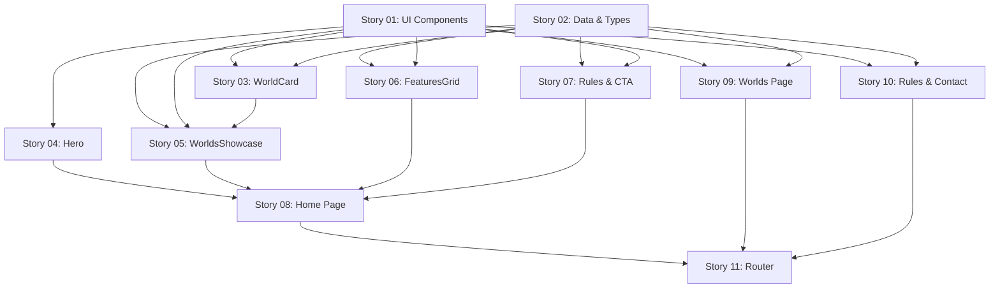

# Stories for Epic 002: Content Pages & UI Component Library

**Source epic:** .storyline/epics/epic-002-content-pages-ui-library.md
**Generated:** 2026-01-12
**Total stories:** 11

---

## Stories Overview

### Story 01: Reusable UI Component Library
**As a:** BlockHaven website developer
**I want:** A library of reusable UI components (Button, Card, Badge, Input, Textarea, Toast, LoadingSpinner)
**Value:** Enables consistent, rapid UI development across all pages
**Status:** Ready for spec
**Estimated effort:** 1 day

### Story 02: Content Data Structures & TypeScript Types
**As a:** BlockHaven website developer
**I want:** TypeScript types and data files for worlds, features, and rules
**Value:** Type-safe content management and easy updates
**Status:** Ready for spec
**Estimated effort:** 4-6 hours

### Story 03: WorldCard Component
**As a:** BlockHaven website visitor
**I want:** To see each world displayed with its screenshot, difficulty, and features
**Value:** Clear visual representation of world options
**Status:** Ready for spec
**Estimated effort:** 3-4 hours

### Story 04: Hero Section Component
**As a:** BlockHaven website visitor
**I want:** An eye-catching landing section with clear CTA
**Value:** Strong first impression and clear call-to-action
**Status:** Ready for spec
**Estimated effort:** 4-5 hours

### Story 05: WorldsShowcase Section Component
**As a:** BlockHaven website visitor
**I want:** To see all 6 worlds in a grid showcase on the homepage
**Value:** Quick overview of server variety
**Status:** Ready for spec
**Estimated effort:** 4-5 hours

### Story 06: FeaturesGrid Section Component
**As a:** BlockHaven website visitor
**I want:** To see key server features highlighted (anti-grief, cross-platform, etc.)
**Value:** Understand server benefits quickly
**Status:** Ready for spec
**Estimated effort:** 3-4 hours

### Story 07: ServerRules & CallToAction Section Components
**As a:** BlockHaven website visitor
**I want:** Brief rules overview and final CTA section
**Value:** Clear expectations and conversion prompt
**Status:** Ready for spec
**Estimated effort:** 3-4 hours

### Story 08: Home Page Assembly
**As a:** BlockHaven website visitor
**I want:** A complete homepage that showcases all server features
**Value:** Primary landing page for player acquisition
**Status:** Ready for spec
**Estimated effort:** 3-4 hours

### Story 09: Worlds Detail Page
**As a:** BlockHaven website visitor
**I want:** A detailed page showing information about all 6 worlds
**Value:** In-depth world information for decision-making
**Status:** Ready for spec
**Estimated effort:** 5-6 hours

### Story 10: Rules & Contact Pages
**As a:** BlockHaven website visitor
**I want:** Complete server rules page and contact page with FAQ
**Value:** Clear policies and support channel
**Status:** Ready for spec
**Estimated effort:** 4-5 hours

### Story 11: React Router Integration
**As a:** BlockHaven website visitor
**I want:** Smooth navigation between all website pages
**Value:** Seamless multi-page experience
**Status:** Ready for spec
**Estimated effort:** 3-4 hours

---

## Story Dependencies



---

## Recommended Execution Order

### Phase 1: Foundation (Day 1-2)
1. **Story 01** - UI Component Library (no dependencies)
2. **Story 02** - Data & Types (no dependencies)

### Phase 2: Components (Day 2-3)
3. **Story 03** - WorldCard (depends on: 01, 02)
4. **Story 04** - Hero Section (depends on: 01)
5. **Story 05** - WorldsShowcase (depends on: 01, 02, 03)
6. **Story 06** - FeaturesGrid (depends on: 01, 02)
7. **Story 07** - Rules & CTA Sections (depends on: 01, 02)

### Phase 3: Pages (Day 3-4)
8. **Story 08** - Home Page (depends on: 04, 05, 06, 07)
9. **Story 09** - Worlds Page (depends on: 01, 02)
10. **Story 10** - Rules & Contact Pages (depends on: 01, 02)

### Phase 4: Integration (Day 4)
11. **Story 11** - React Router (depends on: 08, 09, 10)

---

## Total Estimated Effort

**Time breakdown:**
- Phase 1 (Foundation): 1.5 days
- Phase 2 (Components): 1 day
- Phase 3 (Pages): 0.5 day
- Phase 4 (Integration): 0.5 day

**Total: 3.5-4 days**

---

## Next Steps

### Start with Story 01:
```bash
/spec-story .storyline/stories/epic-002/story-01-ui-component-library.md
```

---

**Status:** ✅ All stories ready for technical spec creation
**Last Updated:** 2026-01-12
