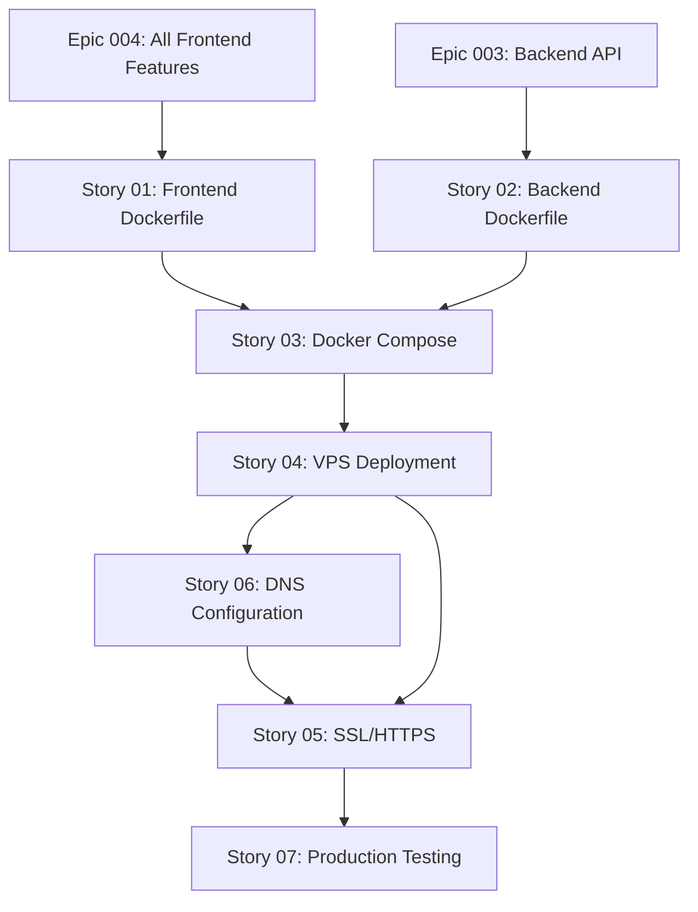

# Stories for Epic 005: Docker Deployment & Production Release

**Source epic:** [.storyline/epics/epic-005-docker-deployment-production.md](../../epics/epic-005-docker-deployment-production.md)

**Generated:** 2026-01-12

**Total stories:** 7

---

## Stories Overview

### Story 01: Frontend Docker Container with Multi-Stage Build
**As a:** DevOps engineer
**I want:** Docker image that builds and serves React frontend efficiently
**Value:** Fast, secure deployment with minimal image size
**Status:** Ready for spec
**File:** [story-01-frontend-docker-container.md](story-01-frontend-docker-container.md)

### Story 02: Backend API Docker Container
**As a:** DevOps engineer
**I want:** Docker image that runs Hono backend API in production mode
**Value:** Containerized, secure API ready for orchestration
**Status:** Ready for spec
**File:** [story-02-backend-docker-container.md](story-02-backend-docker-container.md)

### Story 03: Docker Compose Orchestration
**As a:** DevOps engineer
**I want:** docker-compose.yml that orchestrates frontend and backend services
**Value:** Start entire stack with single command
**Status:** Ready for spec
**File:** [story-03-docker-compose-orchestration.md](story-03-docker-compose-orchestration.md)

### Story 04: VPS Deployment with nginx Reverse Proxy
**As a:** DevOps engineer
**I want:** Deploy Docker containers to Hetzner VPS with nginx reverse proxy
**Value:** Website publicly accessible on VPS
**Status:** Ready for spec
**File:** [story-04-vps-deployment-nginx.md](story-04-vps-deployment-nginx.md)

### Story 05: SSL Certificates and HTTPS Configuration
**As a:** Website visitor
**I want:** Website to use HTTPS encryption
**Value:** Secure data transmission and user trust
**Status:** Ready for spec
**File:** [story-05-ssl-https-configuration.md](story-05-ssl-https-configuration.md)

### Story 06: DNS Configuration and Domain Setup
**As a:** Potential player
**I want:** Access website at bhsmp.com domain
**Value:** Easy to remember and share URL
**Status:** Ready for spec
**File:** [story-06-dns-domain-configuration.md](story-06-dns-domain-configuration.md)

### Story 07: Production Testing and Lighthouse Optimization
**As a:** Website visitor
**I want:** Website to load quickly and perform well
**Value:** Fast, smooth experience on all devices
**Status:** Ready for spec
**File:** [story-07-production-testing-optimization.md](story-07-production-testing-optimization.md)

---

## Story Dependencies



---

## Recommended Implementation Order

### Phase 1: Local Containerization (Day 1, Morning)
1. **Story 01**: Frontend Docker Container *(build and test locally)*
2. **Story 02**: Backend Docker Container *(build and test locally)*
3. **Story 03**: Docker Compose Orchestration *(test full stack locally)*

### Phase 2: VPS Deployment (Day 1, Afternoon)
4. **Story 04**: VPS Deployment with nginx *(deploy to Hetzner, test with IP)*

### Phase 3: Domain & Security (Day 2, Morning)
5. **Story 06**: DNS Configuration *(configure A records, wait for propagation)*
6. **Story 05**: SSL/HTTPS Configuration *(install Let's Encrypt after DNS)*

### Phase 4: Final Verification (Day 2, Afternoon)
7. **Story 07**: Production Testing & Optimization *(Lighthouse audit, cross-browser testing)*

---

## Key Integration Points

### With Epic 001 (Foundation)
- Docker containers serve theme-enabled website
- Theme system works in production

### With Epic 002 (Content Pages)
- All pages (Home, About, Rules, Voting, Contact) deployed
- Content rendered correctly in production

### With Epic 003 (Backend API)
- API endpoints accessible via nginx reverse proxy
- Rate limiting and CORS work in production

### With Epic 004 (Interactive Features)
- Server status polling works with production API
- Contact form submits to production backend
- Toast notifications function correctly
- Performance optimizations applied

---

## INVEST Validation

All stories validated against INVEST criteria:

- ✅ **Independent**: Stories can be developed in order (with noted dependencies)
- ✅ **Negotiable**: Implementation details flexible (e.g., Certbot vs other SSL tools)
- ✅ **Valuable**: Each delivers deployment or security value
- ✅ **Estimable**: Clear scope for each story (1-4 hours each)
- ✅ **Small**: Each fits within a day
- ✅ **Testable**: Clear acceptance criteria for each

---

## Production Environment Details

**VPS Provider:** Hetzner
**VPS IP:** 5.161.69.191
**Domain:** bhsmp.com
**Server OS:** Ubuntu 22.04/24.04 LTS (assumed)
**Docker Version:** Latest stable
**nginx Version:** Latest stable from apt

**Container Architecture:**
- Host: Ubuntu + Docker + nginx (reverse proxy)
- Container 1: web (frontend - nginx:alpine + React SPA)
- Container 2: web-api (backend - node:20-alpine + Hono API)

**Ports:**
- Host: 80 (HTTP), 443 (HTTPS), 22 (SSH)
- web container: 80 (internal)
- web-api container: 3001 (internal)

---

## Testing Checklist

After completing all stories, verify:

### Functionality
- [ ] All pages load (Home, About, Rules, Voting, Contact)
- [ ] Server status widget shows live data
- [ ] Contact form submits successfully
- [ ] Copy IP button works
- [ ] Dark mode toggles and persists
- [ ] All navigation links work

### Performance
- [ ] Lighthouse Performance ≥90
- [ ] Lighthouse Accessibility ≥90
- [ ] Lighthouse Best Practices ≥90
- [ ] Lighthouse SEO ≥90
- [ ] Page load time <2s on 3G
- [ ] First Contentful Paint <1.8s
- [ ] Largest Contentful Paint <2.5s

### Security
- [ ] HTTPS enforced (HTTP redirects to HTTPS)
- [ ] SSL certificate valid (green padlock)
- [ ] Security headers present (HSTS, X-Frame-Options, etc.)
- [ ] No mixed content warnings
- [ ] CORS configured correctly

### Cross-Browser
- [ ] Chrome (latest)
- [ ] Firefox (latest)
- [ ] Safari (latest)
- [ ] Edge (latest)

### Cross-Device
- [ ] Desktop (1920x1080)
- [ ] Laptop (1366x768)
- [ ] Tablet (768x1024)
- [ ] Mobile (375x667)

---

## Next Steps

To create technical specs for these stories, run:

```bash
/spec-story .storyline/stories/epic-005/story-01-frontend-docker-container.md
/spec-story .storyline/stories/epic-005/story-02-backend-docker-container.md
/spec-story .storyline/stories/epic-005/story-03-docker-compose-orchestration.md
/spec-story .storyline/stories/epic-005/story-04-vps-deployment-nginx.md
/spec-story .storyline/stories/epic-005/story-05-ssl-https-configuration.md
/spec-story .storyline/stories/epic-005/story-06-dns-domain-configuration.md
/spec-story .storyline/stories/epic-005/story-07-production-testing-optimization.md
```

Or batch process all stories using the storyline workflow tools.

---

**Epic Status:** ✅ Stories complete, ready for spec creation
