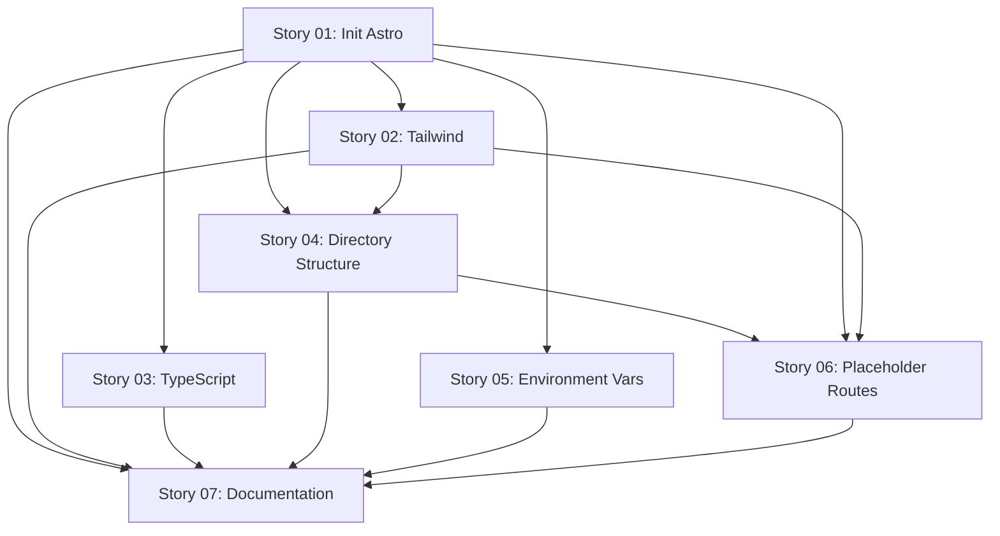

# Stories for Epic BH-WEB-001-01: Site Foundation & Infrastructure

**Source epic:** [epic-BH-WEB-001-01-site-foundation.md](../../epics/epic-BH-WEB-001-01-site-foundation.md)
**Identifier:** BH-WEB-001
**Generated:** 2026-01-22
**Total stories:** 7

## Stories

### Story 01: Initialize Astro Project with Cloudflare Adapter
**As a:** Developer
**I want:** To initialize the Astro project with Cloudflare adapter and core dependencies
**Value:** Working foundation for building the BlockHaven marketing website with hybrid rendering
**Status:** Ready for spec
**File:** [story-01.md](story-01.md)

### Story 02: Configure Tailwind CSS with Minecraft Theme
**As a:** Developer
**I want:** Tailwind CSS configured with a custom Minecraft color palette and theme
**Value:** Build components with consistent, on-brand styling matching Minecraft aesthetic
**Status:** Ready for spec
**File:** [story-02.md](story-02.md)

### Story 03: Configure TypeScript for Astro Development
**As a:** Developer
**I want:** TypeScript properly configured with strict type checking for Astro
**Value:** Catch errors at compile time, better IDE autocomplete and type safety
**Status:** Ready for spec
**File:** [story-03.md](story-03.md)

### Story 04: Create Standard Project Directory Structure
**As a:** Developer
**I want:** A well-organized directory structure following Astro best practices
**Value:** Team knows where to place files, reducing confusion and maintaining consistency
**Status:** Ready for spec
**File:** [story-04.md](story-04.md)

### Story 05: Configure Environment Variables and Wrangler
**As a:** Developer
**I want:** Environment variables properly configured with Wrangler for local Cloudflare Workers development
**Value:** Develop and test API routes locally, keep sensitive configuration secure
**Status:** Ready for spec
**File:** [story-05.md](story-05.md)

### Story 06: Create Placeholder Routes for Dashboard and API
**As a:** Developer
**I want:** Placeholder routes for the future admin dashboard and API endpoints
**Value:** Architecture supports Phase 2 from the start, verify hybrid rendering works
**Status:** Ready for spec
**File:** [story-06.md](story-06.md)

### Story 07: Write Web Project Documentation
**As a:** Developer or future maintainer
**I want:** Comprehensive README documentation for the web project
**Value:** Understand setup, architecture, workflow without asking original developers
**Status:** Ready for spec
**File:** [story-07.md](story-07.md)

## Story Dependencies



## Recommended Order

1. **Story 01** - Initialize Astro Project with Cloudflare Adapter (no dependencies, foundational)
2. **Story 02** - Configure Tailwind CSS with Minecraft Theme (depends on: 01)
3. **Story 03** - Configure TypeScript for Astro Development (depends on: 01)
4. **Story 04** - Create Standard Project Directory Structure (depends on: 01, 02)
5. **Story 05** - Configure Environment Variables and Wrangler (depends on: 01)
6. **Story 06** - Create Placeholder Routes for Dashboard and API (depends on: 01, 02, 04)
7. **Story 07** - Write Web Project Documentation (depends on: 01-06, completes epic)

## INVEST Validation

All stories have been validated against INVEST criteria:

- ✅ **Independent**: Each story can be developed separately (minimal dependencies)
- ✅ **Negotiable**: Implementation details are flexible within each story
- ✅ **Valuable**: Each story delivers clear developer/business value
- ✅ **Estimable**: All stories are well-defined and can be sized (1-5 days each)
- ✅ **Small**: Each story fits within a sprint
- ✅ **Testable**: Clear acceptance criteria for each story

## Next Steps

**Start with Story 01:**
```bash
/sl-spec-story .storyline/stories/epic-BH-WEB-001-01/story-01.md
```

After completing all specs for Epic 1, proceed to **Epic 2: Content System & Data Layer** with:
```bash
/sl-story-creator epic-BH-WEB-001-02-content-system.md
```

## Notes

- These stories establish the technical foundation for the BlockHaven marketing website
- All stories support the hybrid rendering architecture (static + SSR)
- The foundation enables both Phase 1 (marketing site) and Phase 2 (admin dashboard)
- Story 07 creates living documentation that should be updated through Epic 2-5
